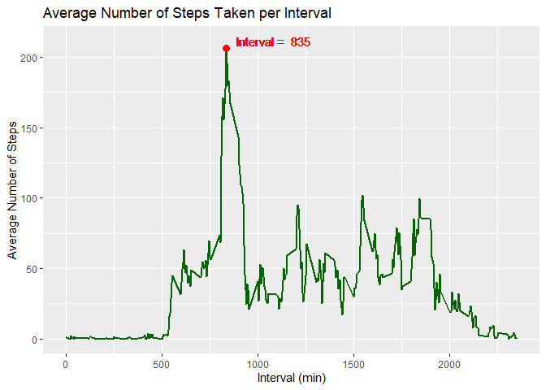
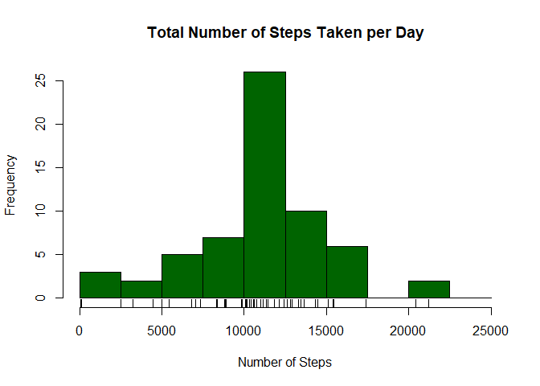
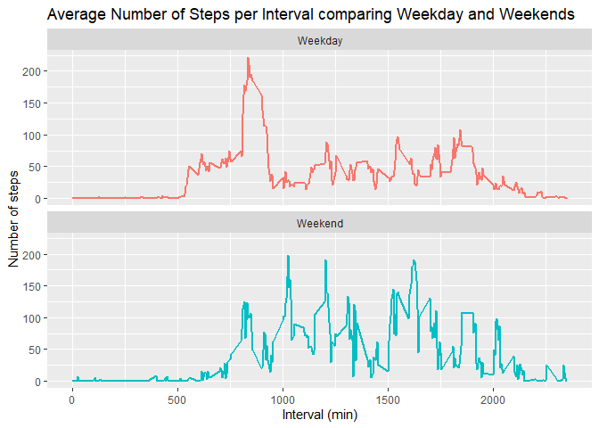

last update: 2021-04-23 12:26:59  

## Loading and preprocessing the data


```r
library(dplyr)

if (!("rawData" %in% ls())){
     fileURL <- "https://d396qusza40orc.cloudfront.net/repdata%2Fdata%2Factivity.zip"
     download.file(fileURL, destfile = "activity.zip")
     
     rawData <- unzip("activity.zip") %>%
          read.csv()
}

activity <- rawData %>%
     mutate(date = as.Date(date),
            weekday = weekdays(date))
```

## What is mean total number of steps taken per day?


```r
steps_sum <- with(activity, aggregate(steps, 
                                      by = list(date),
                                      FUN = sum,
                                      na.rm = TRUE))

hist(steps_sum$x,
     main = "Total Number of Steps Taken per Day",
     xlab = "Number of Steps",
     breaks = seq(0,25000, by=2500),
     col = "darkred")
rug(steps_sum$x)
```

<!-- -->

Mean of total number of steps taken per day:


```r
round(mean(steps_sum$x), 2)
```

```
## [1] 9354.23
```

Median of total number of steps taken per day:


```r
median(steps_sum$x)
```

```
## [1] 10395
```

## What is the average daily activity pattern?

```r
library(ggplot2)

avg_daily <- with(activity, aggregate(steps, 
                                      by = list(interval),
                                      FUN = mean,
                                      na.rm = TRUE))

names(avg_daily) <- c("interval", "mean")
max_mean <- max(avg_daily$mean)

ggplot(data = avg_daily,
       aes(x = interval,
           y = mean)) + 
     geom_line(size = 1,
               color = "darkgreen") +
     labs(title = "Average Number of Steps Taken per Interval",
          x = "Interval (min)",
          y = "Average Number of Steps") +
     geom_point(aes(y = max(mean),
                    x = interval[mean == max_mean]),
                size = 3,
                color = "red") +
     geom_text(aes(y = max_mean + 5,
                   x = interval[mean == max(mean)] + 250,
                   label = paste("Interval = ", 
                                 interval[mean == max_mean])
                   ),
               col = "red"
               )
```

<!-- -->

## Imputing missing values


```r
table(is.na(activity$steps))
```

```
## 
## FALSE  TRUE 
## 15264  2304
```
There are 2304 rows with NAs

The strategy chosen for filling the missing values in the dataset was to use the mean for that 5-minute interval


```r
activity_filled <- activity
for (i in 1:dim(activity)[1]){
        if (is.na(activity$steps[i])){
                activity_filled$steps[i] <- avg_daily$mean[activity_filled$interval[i] == avg_daily$interval]
        }
}

table(is.na(activity_filled$steps))
```

```
## 
## FALSE 
## 17568
```

There is no more NAs in the new dataset  

Now let's see the new histogram:


```r
steps_sum_imputed <- with(activity_filled, 
                          aggregate(steps,
                                    by = list(date),
                                    FUN = sum))

hist(steps_sum_imputed$x,
     main = "Total Number of Steps Taken per Day",
     xlab = "Number of Steps",
     breaks = seq(0,25000, by=2500),
     col = "darkgreen")
rug(steps_sum_imputed$x)
```

<!-- -->

## Are there differences in activity patterns between weekdays and weekends?

1st we add a new column to distinguish which day type the activity is performed, wheather is weekday or weekend.


```r
activity$daytype <- sapply(activity$weekday,
                           function(d) {
                                   if ((d == "Sathurday") || (d == "Sunday")){
                                           w <- "Weekend"
                                   } else {
                                           w <- "Weekday"
                                   }
                                   return(w)
                           })

activity_by_daytype <- aggregate(steps ~ interval + daytype,
                                 data = activity,
                                 FUN = mean,
                                 na.rm = T)
```

Now we plot 1 graphic for each day type so we can compare:


```r
ggplot(activity_by_daytype,
       aes(x = interval,
           y = steps,
           color = daytype)) +
        geom_line(size = 1) +
        facet_wrap(.~daytype,
                   ncol = 1,
                   nrow = 2) +
        labs(title = "Average Number of Steps per Interval comparing Weekday and Weekends",
             x = "Interval (min)",
             y = "Number of steps") +
        theme(legend.position = "none")
```

<!-- -->
